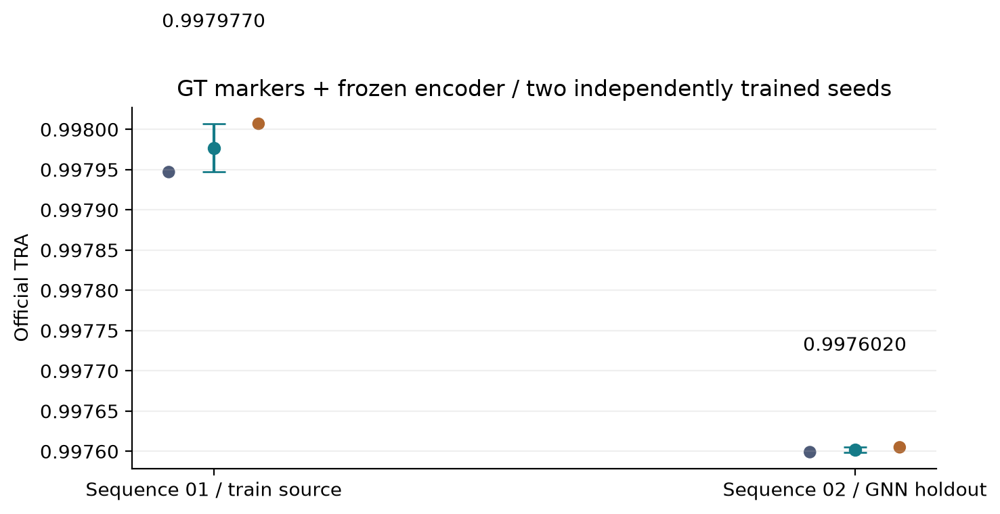
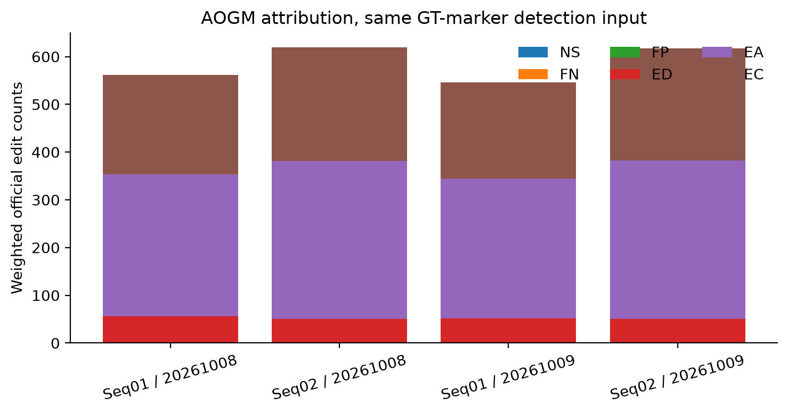
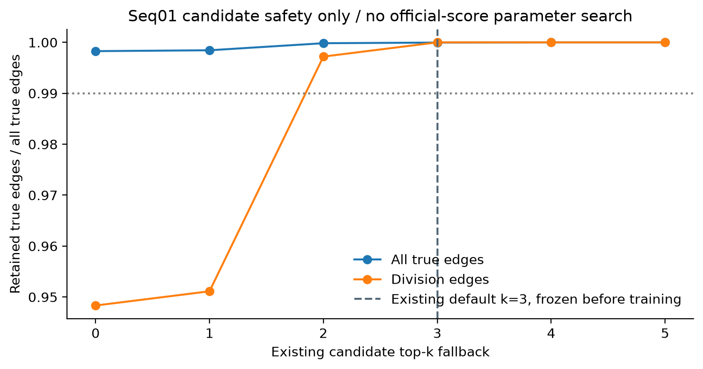

# GT marker Oracle + 冻结 encoder：双序列、双种子官方验证

本轮已完成GT marker输入的冻结encoder特征提取、两个独立GNN训练、双序列官方评测和一次完整seq02重复。
没有加入手工特征对照，也没有重训nnU-Net。结果衡量当前pipeline在排除检测误差后的追踪表现。

## 实验协议

GT Oracle指官方TRA marker的位置与标记掩码，不是nnU-Net前景内用GT种子拆分的实例Oracle，也不是完整细胞分割。
原检测H5共385帧（seq01/02为195/190帧、23802/22418个节点），逐帧与官方TRA标记像素一致。
使用既有nnU-Net fold0的checkpoint_best，冻结stage2 encoder；从原图在GT质心采样128维外观。
GT身份仅用于特征侧车对齐及边监督，不作为身份编码输入模型。实际节点133维=质心3+尺寸1+encoder128+归一化时间1。

候选/生死阈值标定及GNN训练只使用seq01；种子20261008和20261009各训练60轮，内部按时间块划分训练/验证。
每个权重独立评测完整seq01和seq02，再用seed20261008权重重复完整seq02推理、导出与官方评测。
固定uniform质量，不做marker体积守恒筛选，沿用决策0001；保留孤立检测，空洞使用split，不补画新检测。
FGW、运动、多尺度、同帧图、时序上下文、GNN和二层tracklet按现有全模块配置运行。

## 候选安全审计与修复

初版仅检查总体候选召回：部署图保留23757/23798真实关联，但只保留679/716分裂边（94.83%）。
这个隐性问题会被占多数的移动边掩盖。已新增少数类独立标定警告和回归测试，
并在本轮训练前分别检查标定和实际部署图的总体、分裂保留率，任一低于99%即阻断。

仅在seq01实际部署耦合上扫描已有top-k开关（0..5），没有根据官方TRA选参。
使用已有工程保底top-k=3：23797/23798真实关联（99.9958%）、716/716分裂（100%）；
194张实际训练图，跨空洞候选0。初版已精确PID取消，权重、已完成指标及日志保留为诊断，
正式配置重新建图、独立训练两个种子，不复用初版GNN权重。

物理spacing=[1,0.09,0.09]µm；r_max=6.4µm覆盖seq01最大真实位移5.30224µm。
λ_OT=0.001；标定真实C_p99.9=38.27491，λ_OT×C_p99.9=0.038275；
实际训练正边C_p99.9=34.80925、max=75.23230，确认OT正则尺度不会压倒正边监督。

## 官方结果

| 种子 | 序列 | DET | TRA | 轨迹数 | 加权AOGM |
| --- | --- | --- | --- | --- | --- |
| 20261008 | 01 | 1.000000 | 0.997947 | 646 | 562.0 |
| 20261008 | 02 | 1.000000 | 0.997599 | 595 | 619.0 |
| 20261009 | 01 | 1.000000 | 0.998007 | 643 | 545.5 |
| 20261009 | 02 | 1.000000 | 0.997605 | 590 | 617.5 |
| 20261008（重复） | 02 | 1.000000 | 0.997599 | 595 | 619.0 |

| 序列 | TRA均值 | 两种子范围 | 样本标准差（n=2） |
| --- | --- | --- | --- |
| 01 | 0.9979770 | 0.997947–0.998007 | 0.0000424 |
| 02 | 0.9976020 | 0.997599–0.997605 | 0.0000042 |

完整seq02重复的TRA差=0.000000（官方六位小数精度）；两种子波动另列，二者不是同一种噪声。
本轮比较分辨率取max(0.001,重复差,种子全距)=0.001000；两次重复不足以证明所有设置零噪声。
全部5次提交格式通过，无幽灵轨迹或空洞；GT输入下DET恒1。
官方SEG原始输出0已保留，但marker不是细胞分割，不能把该值解释成分割能力。

## AOGM归属

| 种子 | 序列 | NS | FN | FP | ED | EA | EC |
| --- | --- | --- | --- | --- | --- | --- | --- |
| 20261008 | 01 | 0 | 0 | 0 | 56 | 198 | 209 |
| 20261008 | 02 | 0 | 0 | 0 | 51 | 220 | 238 |
| 20261009 | 01 | 0 | 0 | 0 | 52 | 195 | 201 |
| 20261009 | 02 | 0 | 0 | 0 | 51 | 221 | 235 |

全部运行的检测错误项NS/FN/FP均为0；残余失分来自边冗余、边缺失与边语义（ED/EA/EC）。

当前结果支持：GT检测来源下，该pipeline可以完成高精度追踪并在GNN未训练过的seq02上运行。
本轮没有同版本、同协议的手工特征对照，不能归因出encoder本身的提升或下降。
历史GT数值来自不同实现与参数，不作为本轮特征消融基准；初版top-k=0也只作为候选安全诊断。
既有nnU-Net训练包含150/190个seq02帧；seq02只对GNN保持跨序列，不能声称端到端盲测泛化。

## 复核入口

本地151项测试通过；干净源码云端149通过、2跳过（缺POT参考包、源码归档没有Git索引）。
正式训练来源500322cc01433477cea866654faa035d1d617398，190项文件散列校验通过；
源包SHA256=cd3cceff56ebac66e6f78cbe420e30dfea53d516e8c2c0fd646c256bf7f9401e。
首次GT encoder提取来源f35e123；上游检测与冻结模型散列校验通过后正式阶段复用特征。
冻结nnU-Net前后SHA256均为f5388fb1eb4159b26f6976882f2204072378e7c15938a6a68f00aa0d95defdfd。

正式后台PID756340，工作目录/root/CellTracker_oracle_encoder_conservative_20261009；日志位于logs/oracle_encoder_pipeline.log。
原体数据、缓存和完整GNN断点保留在云端；两份逐张量校验的小型推理权重及md5/sha256另存八件套。
大型运行诊断仅压缩长列表，官方指标与日志原样保留；完整证据归档及每项原文件SHA256可追溯。

- [最终指标](../../experiments/E0.9_gt_oracle_encoder_20261009/metrics_final.json)
- [正式配置](../../experiments/E0.9_gt_oracle_encoder_20261009/pipeline_conservative.yaml)
- [正式证据](../../experiments/E0.9_gt_oracle_encoder_20261009/artifacts/evidence_formal/archive_manifest.json)
- [推理权重指纹](../../experiments/E0.9_gt_oracle_encoder_20261009/artifacts/models/manifest.json)

后续显式待办：后续候选消融报告继续分列移动/分裂分母；关闭保底时的候选损失不可误归因于GNN。
