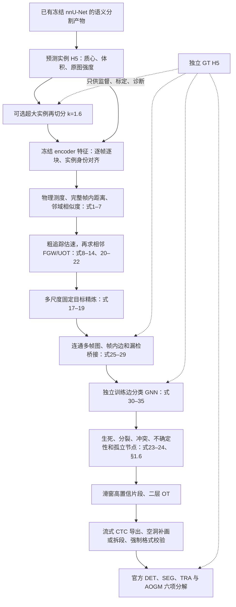

# ideas pipeline 重建与端到端验收

本轮从 `ideas.pdf` 原文重新核对主链路，修复共用求解器和数据接口，再在备用 3
运行完整双序列。主入口为 `scripts/run_ideas_pipeline.py`，方法实现为 `paperpipe/`；
外层旧追踪入口保留为历史基线。公式逐项对应见 `paperpipe/FORMULA_MAP.md`。

## 数据流和实现

本次复用此前已生成的语义分割和原始预测实例，重新建立完整 GT 覆盖映射，
对照再切分，并对两种前端重新提取冻结 encoder 特征。未重新训练 nnU-Net，
也未把本轮特征前向表述为重新运行了全部分割 decoder。原始检测和实验均保留。

主要修复跨越整个 pipeline：

| 阶段 | 修复及验收 |
| --- | --- |
| 求解器 | FGW 保留原始 C，以含熵、广义 KL 的完整目标线搜索；硬平衡不可行显式失败 |
| 表示 | 位置/体积换算 µm/µm³，式6 无额外系数2，FGW 使用完整 D；显式排除 kNN 自身 |
| 时间正则 | 原始质量乘积、完整解析梯度、固定全局目标回溯下降；条件概率方式另列工程对照 |
| 运动先验 | 由粗追踪的真实硬关联估速；编号0不能成为前驱，避免被排除检测互相产生伪速度 |
| 前端身份 | 完整 GT 标记多数覆盖，欠分割保留全部身份；原图强度和 label 与冻结特征严格对齐 |
| 实例再切 | 修复背景编号被偏移成已有实例的缺陷；逐帧新建 H5，保留输入并重新计算全部特征 |
| 图和监督 | 历史上下文真正连通；十维边列有命名；只有目标关联边参与监督；分裂标签不由假阳性推导 |
| 学习 | 恢复论文二分类 sigmoid/BCE 和原始 C 的 OT 项；时间块分割排除上下文重叠；完整随机状态续训 |
| 重建 | 绝对 Γ、生死、体积守恒、替代候选和冲突有独立开关与计数；GT 只供监督和诊断 |
| 长程关联 | 滑动窗口片段和二层 OT，父轨迹引用终末片段；保留重建统计和真实空洞 |
| 导出 | 补画仅写背景，不覆盖其他细胞；连续性、幽灵轨迹、父子时序均在官方入口前检查 |
| 存储和恢复 | 无损压缩逐帧写出；输入/配置/encoder/前端参数写入契约，缓存和权重禁止跨来源误用 |

公式之外的离散细节明确列为工程适配：自适应 ε、特征归一化、窗口拼接、
验证块选择、冲突排序、CTC 空洞补画。top-k 保底、相对质量阈值、条件概率复合、
强度外观、残差和类别加权保留为显式消融选项；本轮严格基准 top-k=0。

## 消融开关

`--list-modules` 可枚举 25 项。配置覆盖 `--set section.field=value`；
`--ablate name` 根据当前状态反向切换。矩阵执行器为每项重建图并独立训练。

| 消融名 | 配置字段/内容 |
| --- | --- |
| ot / unbalanced | 整个 OT 及依赖消费者；`coupling.tau_a/tau_b` |
| appearance / mass / structure | encoder 与强度；体积与均匀质量；完整与截断 D |
| fgw / motion / multiscale / tracklet | 结构项、两遍估速、时间正则、二层 OT |
| ot_candidates / topk / ot_features | 双阈值筛选、候选保底、Γ/C 边特征 |
| intra / similarity / context / bridge | 帧内边、W、历史上下文、漏检跨帧边 |
| gnn / ot_loss | 学习决策、式35 OT 一致性项 |
| division / volume / birth_death | 分裂、体积守恒、出生/终止 |
| isolated / uncertainty | 孤立节点处理、欠分割区域登记 |
| line_search / size_cost | 完整目标回溯、尺寸项 |

前端另有 `resplit_detections.py --k 0/1.6`；导出另有 `hole_policy=fill/split`。
开关验证通过不等于模块收益已被科学验证。

## 本轮实验口径

- 数据为 Fluo-N3DH-CE 完整 seq01（195帧）和 seq02（190帧），真实预测检测档。
- 标定和 GNN 训练仅使用 seq01；两个种子 20261008/20261009，每档独立训练60轮。
- seq02 不参与 GNN 训练或阈值标定，用于跨序列比较。配置比较也查看 seq02，
  因此不将其宣称为从未参与选择的最终盲测集；既有 nnU-Net 训练划分也不重新定义。
- 四档为前端 k=0/1.6 × 孤立节点处理开/关；其余论文机制保留。
- 每档用同一 seed20261008 权重重复完整 seq02 推理、导出和官方评测；
  重复误差与训练种子波动分开报告，不直接沿用历史0.0007。
- λ_OT=0.001 是论文既有损失的尺度标定，不新增损失。对正标签单边损失
  `−log(p)+λCp`，最优 `p=min(1,1/(λC))`；用真实 C 分布检查权重不会强制抑制真实边。
  k=0 标定真实 C 的99.9分位71.33，部署图为61.31，λC约0.061。
- 部署训练图单独核验，不能用更新阈值前的标定图替代。原检测档实际194张图，
  邻帧候选139249、正边22359、分裂正边658；当前密集数据的 missing_only 桥接边为0。

## 验证与结果

本地147项全部通过。云端88bf5ca版本144项通过、1项可选POT对照缺库跳过，
未增加依赖。kNN边界修复后770个真实帧、两种k共1540次邻居索引比较完全相同；
修复只影响空/单实例与重合质心等边界，未改变本轮真实数据邻域。

正式官方结果由 `experiments/E0.8_ideas_final_v3_20261009/metrics_final.json`
和该目录归档的原始官方日志复核；正式运行完成后补入本段数字、图及推荐配置。

旧版 v2 六项筛查发现了运动初始化缺陷，结果完整保留在 E0.6，但不形成
FGW/运动/多尺度/tracklet 有效或无效的结论。未启动的旧版对照训练已取消，
CPU 标定/图、取消原因和恢复日志保留；正式证据均来自独立训练的 v3。

## 复现与仍需回答的问题

每次运行保存配置、命令、环境、源码提交/散列、指标、日志、图和结论。
正式源码为88bf5ca，源包 SHA256 为
`e0d336343b8a662caa8bab5e3db06fd519e52613351eec429f3e5f825bffc04d`。
本地 kNN 边界修复为 b83ef30，有上述全部实际输入等价证明。
冻结 encoder 的模型 SHA256 为
`f5388fb1eb4159b26f6976882f2204072378e7c15938a6a68f00aa0d95defdfd`。

本轮实现包含漏检桥接和空洞补画的回归用例，但真实密集序列没有产生桥接候选，
不能用本轮主表声称实际遮挡恢复有效。合成分割退化、关键扩展的修复版完整
消融终表、更多数据集/种子，以及实例感知分割目标属于后续论文级验证。
距离/边界训练目标需要重新训练 nnU-Net，启动前仍须用户确认。
