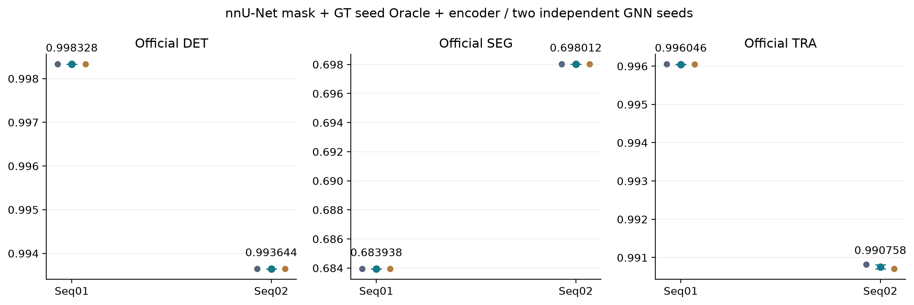
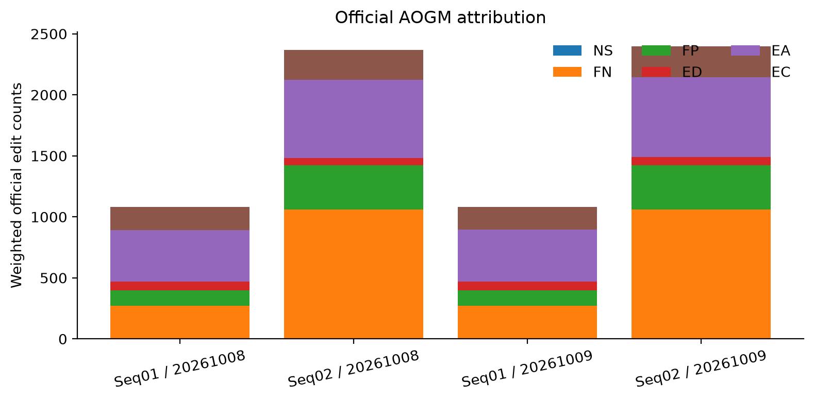
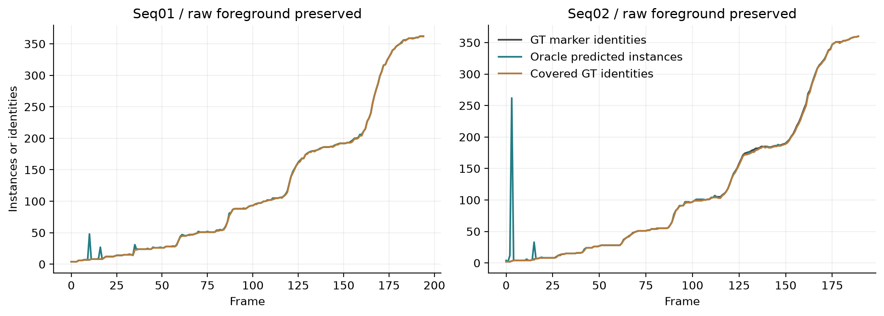

# nnU-Net掩码 + GT种子Oracle实例化 + encoder：正式验证

本轮完成所要求的第三种组合：nnU-Net预测前景保留，GT标记作为实例分水岭种子，
重新提取冻结encoder并独立训练GNN，完成两个种子的双序列官方DET/SEG/TRA及seq02完整重复。
未加入手工特征对照，未重训nnU-Net。

## 检测来源与协议

复用/root/autodl-tmp/nnunet/preds_eval的385帧语义预测（195/190）。逐帧输入文件SHA256留存；
每帧Oracle实例标签的前景严格等于对应nnU-Net预测前景，不增删体素。
使用已有marker-controlled watershed，物理spacing=[1,0.09,0.09]µm，无距离图平滑；
无种子连通域按keep_component保留，min_volume=1不做体积过滤；不再做超大实例再切。
GT标记在预测前景外不会补出检测，GT完整标记多数覆盖规则生成gt_label/gt_ids，缺失和假阳性如实记录。

GT种子是诊断性Oracle信息；它提供实例身份和数量辅助，不是真实细胞边界，不是可部署检测方法。
Oracle实例是nnU-Net细胞区域，质心/体积取自该区域，不使用GT marker体积替代；质量按体积，体积守恒开关开启。
encoder使用冻结checkpoint_best的stage2，在新实例质心从原图采样128维。
GNN节点133维=质心3+尺寸1+encoder128+归一化时间1，不包含GT身份编码。
仅seq01标定和训练；20261008、20261009各60轮；同一权重分别评测两序列。
保留FGW/运动/多尺度/动态图/GNN/tracklet；保留孤立检测，空洞split，不补画新检测。
λ_OT=0.001；物理r_max先按seq01实际Oracle质心位移分布核验，全部阈值仅seq01标定。
分裂与总体候选召回分别审计，任一低于99%禁止开始训练；跨帧桥接正边单独记录，避免候选召回超过1。

## 修复及输入审计

旧外部种子先二值化取连通域，会合并相邻的不同GT身份，或把同一标记被前景截开的碎片拆为多个种子。
已改为保留外部标签身份；全无可见种子时也遵守drop/keep_component策略，并新增回归测试。
Oracle种子转换版本preserve_label_ids_v2进入H5和模型契约，拒绝复用旧Oracle权重；普通预测路径不受版本字段影响。

| 序列 | Oracle节点 | GT节点 | 多数覆盖GT | 未匹配实例 | 旧转换合并身份余量 | 旧转换碎片余量 |
| --- | --- | --- | --- | --- | --- | --- |
| 01 | 23903 | 23802 | 23775 | 128 | 211 | 0 |
| 02 | 22677 | 22418 | 22312 | 365 | 108 | 3 |

上表是输入诊断量，不能替代官方DET；旧转换余量是在相同NN前景/GT标记上直接复现的计数。

seq01真实质心位移p99.9=3.756861µm、最大5.664379µm，冻结物理r_max=6.4µm。
seq02最大位移11.711937µm；只读核验其候选漏斗，不据此调参。
θ_Γ=0.000257016464712，θ_C=260.407102519；
实际194张训练图保留23746/23748条真实相邻边，
分裂边704/704；
λ_OT×真实代价p99.9=0.260523。

| 正式评测候选漏斗 | 真实边 | 门内 | 保留 | 分裂保留/总量 |
| --- | --- | --- | --- | --- |
| seq01 | 23748 | 23748 | 23746 | 704/704 |
| seq02 | 22275 | 22274 | 22269 | 704/709 |

上表分母仅是前端实例空间中可定义的真实边，不包括前端已漏掉的GT节点；不可视为端到端关联召回。

## 官方结果

| 种子 | 序列 | DET | SEG | TRA | 加权AOGM |
| --- | --- | --- | --- | --- | --- |
| 20261008 | 01 | 0.998328 | 0.683938 | 0.996049 | 1081.5 |
| 20261008 | 02 | 0.993644 | 0.698012 | 0.990815 | 2368.0 |
| 20261009 | 01 | 0.998328 | 0.683938 | 0.996043 | 1083.0 |
| 20261009 | 02 | 0.993644 | 0.698012 | 0.990702 | 2397.0 |
| 20261008（重复） | 02 | 0.993644 | 0.698012 | 0.990815 | 2368.0 |

| 序列 | DET均值 | SEG均值 | TRA均值 | TRA两种子范围 |
| --- | --- | --- | --- | --- |
| 01 | 0.9983280 | 0.6839380 | 0.9960460 | 0.996043–0.996049 |
| 02 | 0.9936440 | 0.6980120 | 0.9907585 | 0.990702–0.990815 |

完整seq02重复的DET/SEG/TRA差分别为0.000000/0.000000/0.000000（官方六位小数精度）。
本轮TRA比较分辨率=max(0.001,重复差,种子全距)=0.001000；两次重复不足以证明所有设置零噪声。
全部5次提交格式校验通过。SEG在这一档是细胞区域分割指标，与GT marker档的无意义SEG不同。

## AOGM归属

| 种子 | 序列 | NS | FN | FP | ED | EA | EC |
| --- | --- | --- | --- | --- | --- | --- | --- |
| 20261008 | 01 | 0 | 27 | 128 | 71 | 283 | 188 |
| 20261008 | 02 | 0 | 106 | 365 | 58 | 426 | 246 |
| 20261009 | 01 | 0 | 27 | 128 | 73 | 284 | 186 |
| 20261009 | 02 | 0 | 106 | 365 | 65 | 436 | 253 |

## 结论边界

本轮测量的是GT种子辅助实例划分条件下的追踪与分割表现；不能把Oracle分数当成实际部署结果。
没有同协议手工特征对照，不能归因encoder的独立收益；本轮严格按要求不增加该对照。
历史C4O的drop、min_volume300、旧种子转换及旧追踪实现不同，本轮不是它的同协议encoder消融。
E0.8常规实例采用min_volume300、候选top-k0和空洞fill等不同设置；可以列作背景，不能将分数差归因于单一实例化机制。
NN语义预测与encoder使用既有模型，其训练见过150/190个seq02帧；seq02仅对GNN保持跨序列，且实例划分使用GT种子。
因此本轮不能声称端到端盲测泛化。

## 复现与证据

源码1d84b77569010e73fc0aeb32ecedde1bcfa86bb8；180文件逐项SHA256校验通过；
源码指纹71d96dd9429653e14247b119117a455719aabfbebbf85c97267f440ebe1b4464。
本地155测试通过，云端153通过/2跳过（POT参考、归档无Git索引）。
后台PID836285；/root/CellTracker_nnunet_oracle_encoder_20261009/logs/oracle_encoder_pipeline.log。
冻结模型前后SHA256=f5388fb1eb4159b26f6976882f2204072378e7c15938a6a68f00aa0d95defdfd；原预测、GT、特征和完整训练断点均保留。
两份推理小权重与原断点逐张量一致，保留MD5/SHA256及源码/输入契约。

- [正式指标](../../experiments/E1.0_nnunet_oracle_encoder_20261009/metrics_final.json)
- [正式证据](../../experiments/E1.0_nnunet_oracle_encoder_20261009/../archives/catalog.json)
- [权重指纹](../../experiments/E1.0_nnunet_oracle_encoder_20261009/artifacts/models/manifest.json)

显式后续待办：其他外部标签转换继续核验身份守恒；候选分裂/移动分母及桥接正边继续分列报告。

整理说明（2026-10-09）：入口与目录链接已更新；实验数值和当时的测试计数保持原样。完整原件见 [归档目录](../../experiments/archives/README.md)，保留文件的逐项校验见 [清单](../../experiments/retention_manifest.json)。
